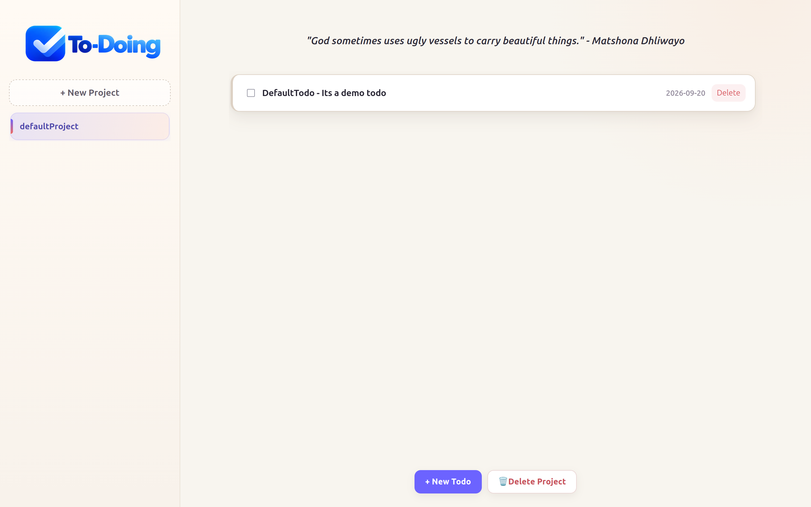

# ToDoing

A simple to-do app completed as part of The Odin Project curriculum.

## Project Overview
This project was built to practice JavaScript, DOM interaction, and app logic while creating a clean task manager interface.

## Preview

## Deployment
The app is deployed on GitHub Pages.

Note: The GitHub Pages deployed version cannot show quotes because the API key environment variable is unavailable in that hosting environment.

## Status
Completed under The Odin Project.
